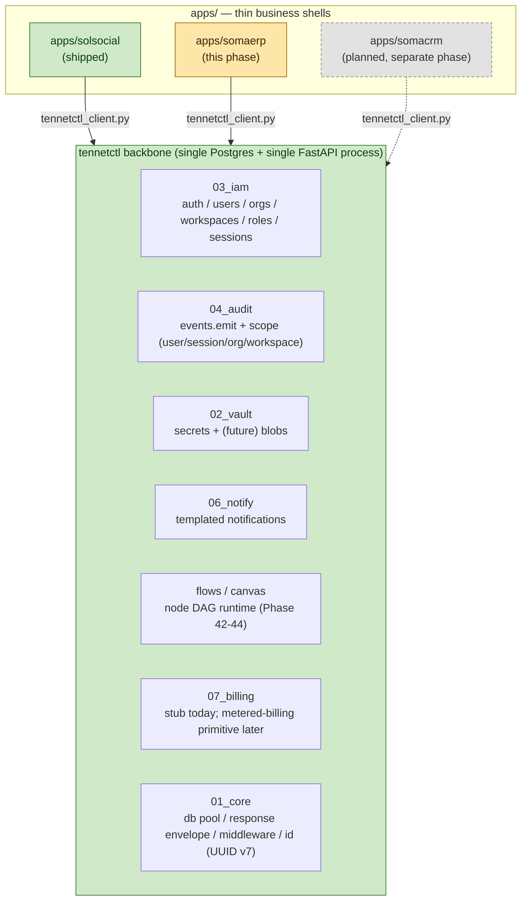
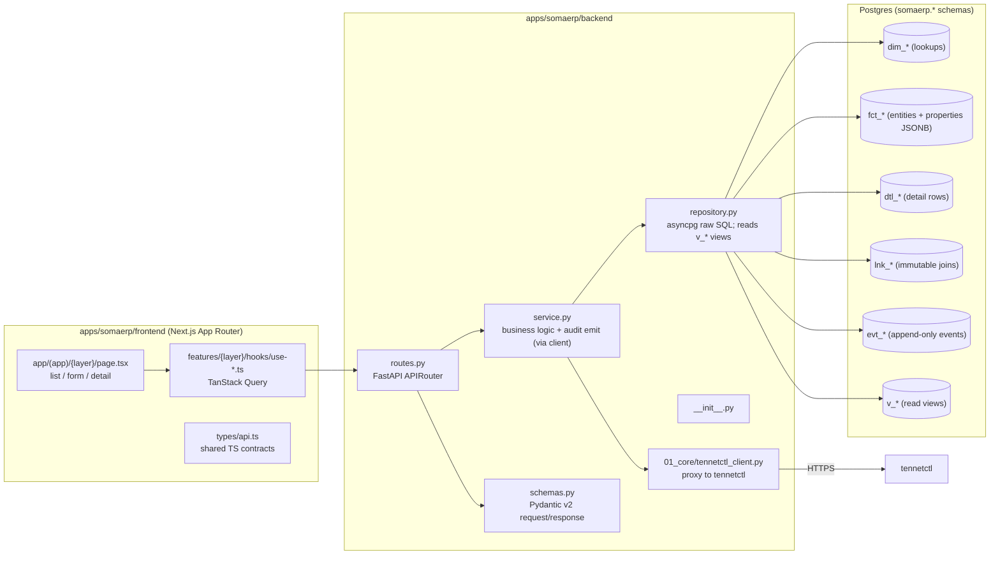

# somaerp — Architecture

## System view

somaerp is a thin business application that consumes tennetctl primitives via the proxy pattern proven by `apps/solsocial`. Every cross-cutting concern (authentication, IAM, audit emission, secrets, file blobs, notifications, multi-step workflows, billing) lives in tennetctl; somaerp owns only the ERP domain (geography, catalog, recipes, quality, raw materials, procurement, production, customers, delivery).



## Layered breakdown of somaerp itself

somaerp follows the same five-file-per-sub-feature shape as tennetctl backend modules. Frontend mirrors the App Router conventions of `apps/solsocial/frontend`.



### Backend sub-feature shape

Every somaerp sub-feature is exactly five files (`__init__.py`, `schemas.py`, `repository.py`, `service.py`, `routes.py`), matching the tennetctl convention. Sub-features map roughly one-to-one to data model layers (`geography`, `catalog`, `recipes`, `quality`, `raw_materials`, `procurement`, `production`, `customers`, `delivery`).

### Frontend layer

- App Router pages under `apps/somaerp/frontend/src/app/(app)/{layer}/`
- TanStack Query hooks under `apps/somaerp/frontend/src/features/{layer}/hooks/`
- All shared types in a single `apps/somaerp/frontend/src/types/api.ts`
- API envelope (`{ ok, data, error }`) checked on every fetch, matching tennetctl convention

## The hybrid data approach (the key architectural call)

somaerp does not adopt the project-wide pure-EAV rule. It uses a **hybrid model**: a hardcoded ERP skeleton (real `fct_*` tables for kitchens, products, recipes, batches, etc.) plus a `properties JSONB NOT NULL DEFAULT '{}'` extension column on every `fct_*` row for tenant-specific custom fields.

This is a documented exception to the pure-EAV rule, justified by:

1. **somaerp is an application layer, not a tennetctl primitive.** The pure-EAV rule protects tennetctl primitives from drift; an app layer that ships a domain-specific shape is allowed to encode that shape in real columns.
2. **Precedent exists.** The monitoring `fct_*` exemption is already on file. somaerp follows the same pattern at a larger scale.
3. **The skeleton is universal.** Every product business has the same skeleton (kitchen → recipe → batch → QC → ship). Tenant variation lives in the `properties JSONB` column, not in the skeleton itself.
4. **Performance and queryability.** Hot-path queries (today's batches at this kitchen, current inventory by raw material, this week's yield by SKU) need real columns and real indexes. A pure-EAV-only model forces every such query into JSONB joins.

Full rationale and rejected alternatives: `08_decisions/002_hybrid_eav_vs_pure_generic.md`.

### Where the JSONB extension lives

Every `fct_*` table in every somaerp schema layer carries:

```text
properties JSONB NOT NULL DEFAULT '{}'
```

Tenant-specific custom fields go into `properties`. A v_* view exposes the row with `properties` flattened where convenient. When a custom field becomes universal (used by 3+ tenants), it gets promoted to a real column in a future migration.

### What does NOT change

- Project-wide UUID v7 PKs on every `fct_*` (uuid7() from `tennetctl.01_core.id`)
- `tenant_id` column on every `fct_*` and every `evt_*` (= tennetctl `workspace_id`)
- `dim_*` lookup tables for enums (no Postgres ENUMs)
- `dtl_*` for detail rows (recipe ingredients, recipe steps, batch consumption, etc.)
- `lnk_*` for immutable many-to-many joins
- `evt_*` for append-only event logs (inventory movements, QC checks, delivery stops)
- `v_*` views as the read surface; raw `fct_/dtl_/evt_/lnk_` tables for writes
- Soft-delete via `deleted_at TIMESTAMP`, not `is_deleted BOOLEAN`
- `updated_at` set explicitly by the application; no triggers

## Module gating

somaerp ships in the same monorepo as tennetctl. It is not a tennetctl module — it is a sibling app process. tennetctl runs on port 51734; somaerp runs on its own port. The two communicate over HTTPS via `apps/somaerp/backend/01_core/tennetctl_client.py`.

Self-host distribution: `docker-compose.somaerp.yml` overlay sets `TENNETCTL_MODULES=core,iam,audit,vault,notify,billing` and points somaerp at the tennetctl URL with a service API key.

## Sibling apps

- `apps/solsocial` — shipped social-media management app; reference implementation of the proxy pattern (`apps/solsocial/backend/01_core/tennetctl_client.py`).
- `apps/somacrm` — planned CRM app for a future phase; will adopt the same proxy pattern and likely reuse some somaerp customer-layer schema concepts.

## Related documents

- `02_tenant_model.md` — the tenant_id = workspace_id decision
- `08_decisions/001_tenant_boundary_org_vs_workspace.md`
- `08_decisions/002_hybrid_eav_vs_pure_generic.md`
- `08_decisions/008_tennetctl_primitive_consumption.md`
- `04_integration/00_tennetctl_proxy_pattern.md`
- Office-hours design doc: `~/.gstack/projects/srigaddeks-tennetctl/sri-feat-saas-build-design-20260424-111411.md`
