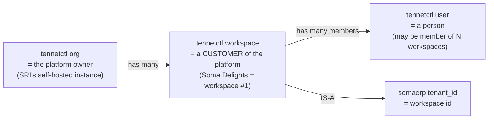

# somaerp — Tenant Model

## The canonical answer

A **tenant in somaerp is a tennetctl workspace**. There is no `somaerp.tenants` table, no `somaerp.organizations` table, no parallel identity registry. Every `fct_*` and every `evt_*` row in somaerp carries `tenant_id UUID` whose value is a `tennetctl.03_iam.workspaces.id`.

Formal decision: `08_decisions/001_tenant_boundary_org_vs_workspace.md`.

## The three identity layers

| Concept | tennetctl entity | somaerp uses it as |
| --- | --- | --- |
| Platform owner | `org` (one per self-hosted install in single-tenant mode; many in multi-tenant) | tenant_id container; never referenced directly in somaerp tables |
| Customer of the platform | `workspace` | the somaerp `tenant_id` |
| End user | `user` (member of a workspace via lnk_workspace_members) | actor for audit, owner of created_by, RBAC subject |
| Permission scope | role assignment scoped to workspace | RBAC enforcement boundary in somaerp |

## Why workspace, not org

- An org represents the platform owner. somaerp shipped at scale runs many tenants under one platform; each customer must NOT see another customer's data, so the boundary lives one level below org.
- The kbio + kprotect precedent (memory: `project_kbio_kprotect.md`, `feedback_shared_org_workspace.md`) already established that domain apps share the tennetctl org and use workspaces to scope their data.
- Per-workspace RBAC, per-workspace audit scope, per-workspace vault, and per-workspace notify templates are already supported by the tennetctl primitives — no new isolation code needed in somaerp.

## Multi-org / multi-workspace topology

somaerp supports both shapes from day 1:

- **Single-tenant deployment (e.g. Soma Delights running its own self-host).** One tennetctl org, one workspace, all somaerp data scoped to that workspace.
- **Multi-tenant deployment (the empire shape).** One tennetctl org (the platform), N workspaces (one per customer business), every somaerp row scoped by `tenant_id = workspace.id`.

Soma Delights = workspace #1 in any deployment.

## Isolation guarantees

Every somaerp `fct_*` and `evt_*` table carries `tenant_id` and the column is non-nullable. Every read query filters by `tenant_id` derived from the authenticated session's workspace context. The repo layer never accepts a `tenant_id` from request input; it is always pulled from the authenticated workspace context.

Optional defense-in-depth: per-workspace Postgres Row Level Security policies on the heaviest tables (production batches, inventory movements, customer records). Not enabled in v0.9.0; documented as a v1.0 enhancement in `03_scaling/00_multi_tenant_strategy.md`.

## RBAC

RBAC is delegated entirely to tennetctl `03_iam`. somaerp registers an application in tennetctl (`code = somaerp`), declares the role keys it needs (e.g. `somaerp.production.write`, `somaerp.procurement.read`, `somaerp.qc.sign_off`), and queries `/v1/roles?application_id=...&workspace_id=...` to enforce.

Roles are scoped at workspace level — a user can be `production_lead` in workspace A and `viewer` in workspace B.

## Audit scope (mandatory on every mutation)

Per the project-wide `feedback_audit_scope_mandatory` rule, every audit event carries the four-tuple:

- `user_id` — the acting user (from session)
- `session_id` — the active session (from session)
- `org_id` — the platform owner org (from session)
- `workspace_id` — the somaerp tenant_id (from session)

Every somaerp service-layer mutation calls `tennetctl_client.emit_audit(...)` with this four-tuple plus an event key from the somaerp namespace (`somaerp.{layer}.{action}`, e.g. `somaerp.production.batches.created`).

Two documented bypasses, inherited from tennetctl audit rules:

1. **Setup category.** First-tenant bootstrap seeds (Soma Delights initial config) emit with `category = setup`, which is allowed to omit `user_id` because no user exists yet.
2. **Failure outcome.** A failed mutation emits with `outcome = failure` and may carry partial scope when the request never reached an authenticated state.

## Cross-tenant FKs are forbidden

No somaerp foreign key may reference an entity in a different `tenant_id`. The schema migrations enforce this through composite indexes (`tenant_id` always leads). Cross-tenant references would break the future shard-by-tenant strategy described in `03_scaling/00_multi_tenant_strategy.md`.

## Bootstrap

When a new workspace is created in tennetctl, somaerp does NOT auto-provision tenant data. A separate bootstrap step (plan 56-02 onwards) seeds the per-tenant config (locations, kitchens, products, recipes, suppliers, routes) under that workspace_id. The Soma Delights bootstrap is fully specified in `05_tenants/01_somadelights_tenant_config.md`.

## Related documents

- `08_decisions/001_tenant_boundary_org_vs_workspace.md`
- `04_integration/01_auth_iam_consumption.md`
- `04_integration/02_audit_emission.md`
- `03_scaling/00_multi_tenant_strategy.md`
- Memory: `feedback_shared_org_workspace.md`, `project_kbio_kprotect.md`, `feedback_audit_scope_mandatory.md`
