# Data Model: Overview

## What this section covers

The somaerp data model is split into 9 logical layers. Each layer is documented in its own file (`01_geography.md` through `09_delivery.md`). This overview gives the cross-layer ER picture, the entity catalog, and the conventions every layer-doc assumes.

## Reading order

1. `01_geography.md` — physical world: regions, locations, kitchens, capacity, service zones
2. `02_catalog.md` — what we sell: product lines, products, variants, tags
3. `03_recipes.md` — how we make it: versioned recipes, ingredients, steps, kitchen overrides
4. `04_quality.md` — how we check it: QC checkpoints, append-only QC events
5. `05_raw_materials.md` — what we buy: raw materials, units, suppliers
6. `06_procurement.md` — how we buy and track stock: append-only procurement runs and inventory movements
7. `07_production.md` — daily ops: production batches with state machine, consumption, QC results
8. `08_customers.md` — who we sell to: customers, subscription plans, subscriptions
9. `09_delivery.md` — how we ship: routes, riders, append-only delivery runs and stops

## Cross-layer ER diagram

```mermaid
erDiagram
  fct_regions ||--o{ fct_locations : has
  fct_locations ||--o{ fct_kitchens : hosts
  fct_locations ||--o{ fct_customers : addresses
  fct_kitchens ||--o{ fct_kitchen_capacity : declares
  fct_kitchens ||--o{ fct_service_zones : serves
  fct_product_lines ||--o{ fct_products : groups
  fct_products ||--o{ fct_product_variants : has
  fct_products ||--o{ fct_recipes : has
  fct_recipes ||--o{ dtl_recipe_ingredients : lists
  fct_recipes ||--o{ dtl_recipe_steps : lists
  fct_recipes ||--o{ lnk_kitchen_recipe_overrides : may_override
  fct_kitchens ||--o{ lnk_kitchen_recipe_overrides : applies
  fct_raw_materials ||--o{ dtl_recipe_ingredients : used_in
  fct_raw_materials ||--o{ lnk_raw_material_suppliers : sourced_from
  fct_suppliers ||--o{ lnk_raw_material_suppliers : supplies
  fct_suppliers ||--o{ fct_procurement_runs : fulfills
  fct_kitchens ||--o{ fct_procurement_runs : receives
  fct_procurement_runs ||--o{ dtl_procurement_lines : contains
  dtl_procurement_lines ||--o{ evt_inventory_movements : received_as
  fct_kitchens ||--o{ evt_inventory_movements : holds
  fct_raw_materials ||--o{ evt_inventory_movements : tracked_as
  fct_kitchens ||--o{ fct_production_batches : produces
  fct_products ||--o{ fct_production_batches : makes
  fct_recipes ||--o{ fct_production_batches : pinned_by
  fct_production_batches ||--o{ dtl_batch_step_logs : logs
  fct_production_batches ||--o{ dtl_batch_ingredient_consumption : consumes
  fct_production_batches ||--o{ dtl_batch_qc_results : checked_by
  fct_production_batches ||--o{ evt_inventory_movements : drives_consumption
  evt_qc_checks }o--|| fct_production_batches : verifies
  evt_qc_checks }o--|| dim_qc_checkpoints : at
  fct_subscriptions }o--|| fct_customers : owned_by
  fct_subscriptions }o--|| dim_subscription_plans : follows
  dim_subscription_plans ||--o{ dtl_subscription_plan_items : contains
  fct_products ||--o{ dtl_subscription_plan_items : included_in
  evt_subscription_pauses }o--|| fct_subscriptions : pauses
  fct_kitchens ||--o{ fct_delivery_routes : ships_from
  fct_delivery_routes ||--o{ lnk_route_customers : serves
  fct_customers ||--o{ lnk_route_customers : on
  fct_delivery_routes ||--o{ evt_delivery_runs : executed_as
  evt_delivery_runs ||--o{ evt_delivery_stops : visits
  fct_customers ||--o{ evt_delivery_stops : delivers_to
  fct_riders ||--o{ evt_delivery_runs : performed_by
```

## Entity catalog

| Layer | Entity | Type | Owns sub-feature | One-line description |
|---|---|---|---|---|
| 01 geography | `dim_regions` | dim | geography | Country/state lookup; FSSAI/regulatory anchor |
| 01 geography | `fct_locations` | fct | geography | City-level location (Hyderabad, Bangalore, ...) |
| 01 geography | `fct_kitchens` | fct | geography | Physical production facility |
| 01 geography | `fct_kitchen_capacity` | fct | geography | Capacity per (kitchen × product_line × time_window × validity) |
| 01 geography | `fct_service_zones` | fct | geography | Delivery polygon mapped to a kitchen |
| 02 catalog | `dim_product_categories` | dim | catalog | Beverage / pulp / shot / packaged-food categories |
| 02 catalog | `dim_product_tags` | dim | catalog | Wellness tags (immunity, energy, detox, hydration) |
| 02 catalog | `fct_product_lines` | fct | catalog | Cold-Pressed Drinks, Fermented Drinks, Dehydrated Pulp |
| 02 catalog | `fct_products` | fct | catalog | SKU (Green Morning, Citrus Immunity, ...) |
| 02 catalog | `fct_product_variants` | fct | catalog | Size / packaging variant (300ml, 500ml) |
| 02 catalog | `lnk_product_tags` | lnk | catalog | product ↔ tag many-to-many |
| 03 recipes | `dim_recipe_step_kinds` | dim | recipes | chop / wash / press / blend / bottle / label |
| 03 recipes | `fct_recipes` | fct | recipes | Versioned recipe with status (draft/active/archived) |
| 03 recipes | `dtl_recipe_ingredients` | dtl | recipes | Ingredient line per recipe |
| 03 recipes | `dtl_recipe_steps` | dtl | recipes | Step line per recipe |
| 03 recipes | `lnk_kitchen_recipe_overrides` | lnk | recipes | Per-kitchen override of a base recipe |
| 04 quality | `dim_qc_check_types` | dim | quality | visual / smell / weight / temperature / taste |
| 04 quality | `dim_qc_stages` | dim | quality | pre_production / in_production / post_production / fssai |
| 04 quality | `dim_qc_checkpoints` | dim | quality | Reusable checkpoint (recipe-step bound, criteria_jsonb) |
| 04 quality | `evt_qc_checks` | evt | quality | Append-only QC event (batch_id + checkpoint + result + photo) |
| 05 raw_materials | `dim_raw_material_categories` | dim | raw_materials | leafy / root / fruit / herb / spice / packaging |
| 05 raw_materials | `dim_units_of_measure` | dim | raw_materials | kg / g / ml / l / count |
| 05 raw_materials | `dim_supplier_source_types` | dim | raw_materials | wholesale_market / farm / marketplace / brand |
| 05 raw_materials | `fct_raw_materials` | fct | raw_materials | Spinach, beetroot, ginger, PET bottle, label, ... |
| 05 raw_materials | `fct_raw_material_variants` | fct | raw_materials | Organic vs regular variant of a raw material |
| 05 raw_materials | `fct_suppliers` | fct | raw_materials | Vendor (Bowenpally Wholesale, Rythu Bazaar, ...) |
| 05 raw_materials | `lnk_raw_material_suppliers` | lnk | raw_materials | raw_material ↔ supplier with `is_primary` |
| 06 procurement | `fct_procurement_runs` | fct | procurement | One shopping trip (kitchen + supplier + run_date + cost) |
| 06 procurement | `dtl_procurement_lines` | dtl | procurement | Per-line item with `lot_number` for FSSAI |
| 06 procurement | `evt_inventory_movements` | evt | procurement | Append-only stock event (received/consumed/wasted/returned/adjusted) |
| 07 production | `fct_production_batches` | fct | production | One production run; state machine; recipe-pinned |
| 07 production | `dtl_batch_step_logs` | dtl | production | Per-step timestamps and actor |
| 07 production | `dtl_batch_ingredient_consumption` | dtl | production | Planned vs actual ingredient quantity per batch |
| 07 production | `dtl_batch_qc_results` | dtl | production | Per-batch QC summary linking evt_qc_checks |
| 08 customers | `dim_subscription_plans` | dim | customers | Plan template (Morning Glow, Hydration Habit, ...) |
| 08 customers | `fct_customers` | fct | customers | End customer of the tenant |
| 08 customers | `dtl_subscription_plan_items` | dtl | customers | Plan ↔ product mix (qty per delivery, weekday rotation) |
| 08 customers | `fct_subscriptions` | fct | customers | A customer's active subscription instance |
| 08 customers | `evt_subscription_pauses` | evt | customers | Append-only pause event with from/to/reason |
| 09 delivery | `dim_rider_roles` | dim | delivery | Roles for riders (lead / partner / backup) |
| 09 delivery | `fct_delivery_routes` | fct | delivery | Named route with sequence_jsonb |
| 09 delivery | `fct_riders` | fct | delivery | Rider profile referencing tennetctl iam user |
| 09 delivery | `lnk_route_customers` | lnk | delivery | Route ↔ customer with sequence_position |
| 09 delivery | `evt_delivery_runs` | evt | delivery | One run of a route on a date by a rider |
| 09 delivery | `evt_delivery_stops` | evt | delivery | Per-customer stop with photo_vault_key |

## Conventions (assumed by every layer doc)

- **Primary keys.** Every `fct_*` row carries `id UUID PRIMARY KEY DEFAULT uuid7()` (UUID v7, sourced from `tennetctl.01_core.id`). `dim_*` tables use `SMALLINT PRIMARY KEY` for fixed lookup sets where the universe is small (qc stages, rider roles); `dim_*` tables that grow per-tenant (subscription plans) use UUID v7 PKs.
- **Tenant scoping.** Every `fct_*` and every `evt_*` table carries `tenant_id UUID NOT NULL`. The value is a `tennetctl.03_iam.workspaces.id`. Composite indexes always lead with `tenant_id`.
- **JSONB extension.** Every `fct_*` table carries `properties JSONB NOT NULL DEFAULT '{}'` for tenant-specific custom fields per ADR-002.
- **Timestamps.** All timestamps are `TIMESTAMP WITH TIME ZONE` stored as UTC. `created_at TIMESTAMPTZ NOT NULL DEFAULT now()` and `updated_at TIMESTAMPTZ NOT NULL DEFAULT now()` on every `fct_*`. `evt_*` tables only carry `created_at` (no `updated_at`).
- **Soft delete.** `deleted_at TIMESTAMPTZ` (nullable) on every `fct_*`. Never `is_deleted BOOLEAN`. `evt_*` tables never soft-delete.
- **Actors.** Mutable `fct_*` rows carry `created_by UUID NOT NULL`, `updated_by UUID NOT NULL` referencing tennetctl users. Append-only `evt_*` carries `actor_user_id UUID NOT NULL` (or service marker for system events).
- **Money.** Monetary columns use `NUMERIC(14,4)` plus a sibling `currency_code CHAR(3)` (ISO 4217). Default for the Soma Delights tenant: INR.
- **Reads vs writes.** Reads always go through `v_*` views which join in dim labels and flatten `properties`. Writes always go to raw `fct_*` / `dtl_*` / `evt_*` tables.
- **No cross-tenant FKs.** All FKs are within the same `tenant_id`. References to tennetctl entities (users, workspaces) are by id only — no FK constraint, since they live in a sibling Postgres schema.
- **Audit emission.** Every mutation in service.py calls `tennetctl_client.emit_audit("somaerp.{layer}.{entity}.{action}", scope=...)`. Audit keys are listed in each layer doc.

## Open questions deferred to plan-time

- Should `dim_*` per-tenant tables (subscription plans) be replaced by `fct_*` since they carry tenant_id? Convention from tennetctl is dim = global; we extend `dim_subscription_plans` with `tenant_id` because the plan menu is tenant-defined. Plan 56-10 may revisit.
- Materialized view vs plain view for `v_inventory_current` and `v_batch_summary` — defaulted to plain view; revisit at >10k movements/day.
- Where to store delivery route polygon geometry (PostGIS extension vs JSONB) — defaulted to JSONB; revisit when route optimization workflow ships.
